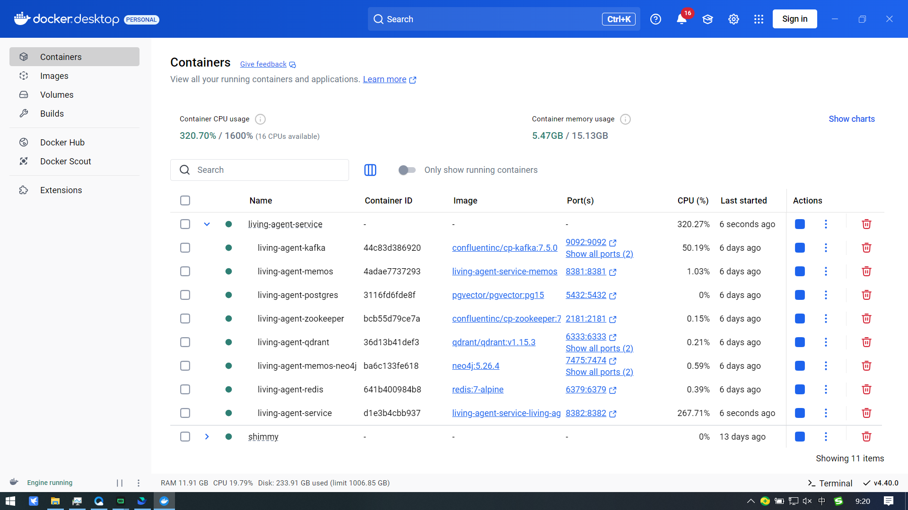
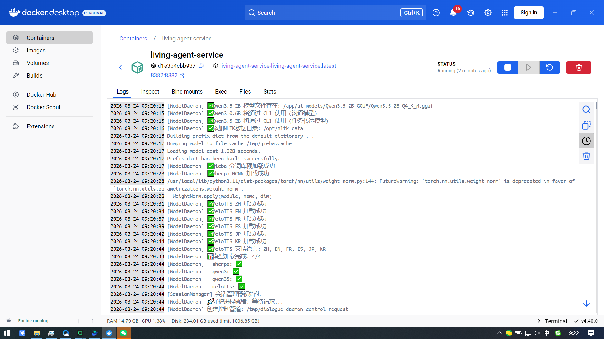

# Living Agent Service

<div align="center">

**企业级生命智能体自治系统**

*神经元架构 · 自主进化 · 赚钱驱动 · 持续成长*

[](https://openjdk.org/)
[](https://spring.io/projects/spring-boot)
[](https://www.rust-lang.org/)
[](LICENSE)

[English](#english) | [中文文档](#中文文档)

</div>

---

## 中文文档

完全个人思路，考虑到企业使用，所以设计是尽量按本地部署处理。因代码能力有限，所以一些功能还在完善中。希望能得到大佬的建议和帮助。

### 项目定位

企业的"OpenClaw" —— 新一代企业级智能体服务平台，专注于构建**生命智能体自治系统**。

**核心设计理念：**
- **神经元群聊模式** - 每个智能体作为"神经元"，通过通讯管路协作
- **仿脑神经中枢架构** - 按大脑功能分区设计智能体职责
- **带生命的智能体** - 具备感知、决策、执行、学习、进化、赚钱能力
- **自主进化驱动** - 通过赚钱实现经济独立，收益用于硬件升级和技能进化

---

### 核心特性

#### 三层LLM智能架构

采用业界领先的多层大语言模型协同架构，实现"大脑-神经元"两级智能处理：

| 层级 | 模型/组件 | 职责 | 硬件需求 |
|------|----------|------|---------|
| **决策层** | MainBrain (Qwen3.5-27B) | 战略决策、复杂推理、跨部门协调 | RTX 4090 / A100 |
| **执行层** | 9个部门大脑 + 32个数字员工 | 业务执行、任务处理、部门协作 | RTX 3060 12GB / CPU |
| **工具层** | Qwen3.5-2B (默认) / BitNet-1.58-3B (备选) | 工具检测、兜底处理、触发进化信号 | GPU: 4GB / CPU: 1GB |

**执行层详解**：

```
┌─────────────────────────────────────────────────────────────────────────────┐
│                           执行层架构                                          │
├─────────────────────────────────────────────────────────────────────────────┤
│                                                                             │
│  【前台闲聊神经元】Qwen3-0.6B                                                │
│  ├── 职责: 日常对话、快速响应、离职/外来人员闲聊                               │
│  └── 特点: 轻量级、低延迟、无状态                                             │
│                                                                             │
│  【部门业务大脑】9个                                                          │
│  ├── TechBrain (技术部) - 代码审查、CI/CD、架构设计                           │
│  ├── HrBrain (人力资源) - 招聘管理、考勤、绩效                                │
│  ├── FinanceBrain (财务部) - 报销审批、发票、预算                             │
│  ├── SalesBrain (销售部) - 销售支持、市场营销                                │
│  ├── CsBrain (客服部) - 工单处理、问题解答                                   │
│  ├── AdminBrain (行政部) - 文档处理、文案创作                                │
│  ├── LegalBrain (法务部) - 合同审查、合规检查                                │
│  ├── OpsBrain (运营部) - 数据分析、运营策略                                  │
│  └── CoreBrain (核心层) - 搜索、知识图谱、主动代理                            │
│                                                                             │
│  【数字员工】32个固定员工                                                     │
│  ├── 技术部 (10人): 代码审查员、架构师、DevOps工程师、运维工程师等             │
│  ├── 财务部 (4人): 财务会计、报销审核员、成本核算员、预算管理员                │
│  ├── 运营部 (4人): 数据分析师、运营专员、任务调度员、流程管理员                │
│  ├── 销售部 (3人): 销售代表、市场专员、渠道经理                               │
│  ├── 人力资源 (2人): 招聘专员、绩效管理员                                     │
│  ├── 客服部 (2人): 客服专员、工单处理员                                       │
│  ├── 行政部 (3人): 行政助理、文档管理员、文案策划                             │
│  ├── 法务部 (2人): 合同审查员、合规专员                                       │
│  └── 跨部门 (2人): 协调员、战略规划师                                         │
│                                                                             │
└─────────────────────────────────────────────────────────────────────────────┘
```

> **动态模型选择**：Layer 3 支持 `ToolNeuronModelSelector` 根据硬件资源自动切换模型
> - 内存 ≥ 4GB + CPU ≥ 4核 → Qwen3.5-2B (262K上下文、多模态)
> - 资源受限 → BitNet-1.58-3B (低内存、CPU推理)

#### 九大部门大脑 · 76个技能

企业级组织架构映射，每个部门配备专属智能大脑：

```
┌─────────────────────────────────────────────────────────────────────────────┐
│                         MainBrain (总控大脑)                                  │
│                            Qwen3.5-27B                                       │
├─────────┬─────────┬─────────┬─────────┬─────────┬──────────────────────────┤
│TechBrain│SalesBrain│ HrBrain │FinBrain │ CsBrain │      LegalBrain          │
│ 技术部   │  销售部  │ 人力部  │ 财务部  │ 客服部  │        法务部            │
│ 25技能   │  4技能   │  3技能  │  4技能  │  3技能  │        3技能             │
├─────────┴─────────┴─────────┴─────────┴─────────┴──────────────────────────┤
│              AdminBrain · OpsBrain · CoreBrain                               │
│                 行政部 · 运维部 · 核心层                                       │
│                   15技能 · 9技能 · 10技能                                      │
└─────────────────────────────────────────────────────────────────────────────┘
```

每位数字员工具备独立人格参数（严谨度、创造力、风险容忍、服从度），可继承或覆盖部门默认人格。

#### 神经元架构

革命性的分布式智能单元设计：

- **独立执行** - 每个神经元作为独立执行单元，拥有专属工具集和状态机
- **管道通信** - Channel-based消息传递，支持单播、广播、优先级队列、轮询分发
- **弹性扩展** - 神经元可动态注册、热加载、水平扩展
- **容错机制** - 内置熔断器、重试策略、降级处理

#### 自主进化系统

智能体自我进化能力：

```
信号提取 → 决策引擎 → 进化执行 → 效果验证 → 知识沉淀
    ↓           ↓           ↓           ↓           ↓
  8种信号    5种策略    自动修复    熔断保护    三层知识库
```

**进化信号类型**：ERROR | OPPORTUNITY | STABILITY | DRIFT | CAPABILITY_GAP | PERFORMANCE | USER_REQUEST | SYSTEM_EVENT

**进化策略**：REPAIR（修复）| OPTIMIZE（优化）| INNOVATE（创新）| DEFER（延迟）| ESCALATE（上报）

#### 贾维斯模式主动预判

像钢铁侠的贾维斯一样，在用户开口之前就做好准备：

| 预判类型 | 能力描述 | 应用场景 |
|---------|---------|---------|
| **时间预判** | 基于时间规律预测任务 | 周报自动生成、会议提醒 |
| **事件预判** | 基于系统事件触发动作 | 新员工入职流程、项目里程碑 |
| **模式预判** | 基于用户行为模式预测 | 登录后推荐、会前准备材料 |
| **风险预判** | 基于风险指标预警 | 项目延期预警、预算超支提醒 |

#### 三层知识库体系

成长型知识管理架构，实现知识从个人到企业的晋升流转：

```
L1: 神经元私有知识 (SQLite)          → 个人经验、对话历史
         ↓ 晋升验证
L2: 大脑领域知识 (PostgreSQL+Qdrant) → 部门最佳实践、业务规则
         ↓ 跨部门验证
L3: 共享知识库 (PostgreSQL+Qdrant)   → 通用知识、公司制度
```

知识具备生命周期管理：获取 → 验证 → 晋升 → 衰退 → 清理

#### Rust高性能原生引擎

核心性能敏感模块采用Rust实现，通过JNI与Java服务集成：

| 模块 | 性能指标 |
|------|---------|
| **音频处理** | Opus编解码 < 5ms，VAD检测 < 1ms |
| **并发通道** | 消息吞吐 > 1M msg/s，延迟 < 100μs |
| **本地存储** | 写入 QPS > 10K/s，读取 QPS > 50K/s |
| **安全验证** | 命令校验 < 1ms，沙箱隔离 512MB |

#### 企业级安全体系

多层次安全防护机制：

- **沙箱执行** - 资源隔离、网络限制、路径管控
- **命令审计** - 危险命令黑名单、注入攻击防护
- **权限控制** - 部门级访问控制、操作审批流程
- **自主级别** - READ_ONLY | SUPERVISED | FULL 三级自主权限

---

### 统一员工模型

创新性地将人类员工与数字员工统一建模：

```
┌─────────────────────────────────────────────────────────────────────────────┐
│                         统一员工模型 (Unified Employee Model)                  │
├─────────────────────────────────────────────────────────────────────────────┤
│                                                                             │
│  【真实员工 Human Employee】                                                  │
│  ├── 认证ID：企业系统账号 (钉钉/飞书/OA)                                      │
│  ├── 信息传递：互动式 (需要人工响应)                                          │
│  ├── 触发方式：被动接收通知，主动发起请求                                      │
│  └── 状态：在线/离线/忙碌                                                    │
│                                                                             │
│  【数字员工 Digital Employee】                                                │
│  ├── 认证ID：系统生成 (employee://digital/{domain}/{name}/{instance})        │
│  ├── 信息传递：自主式 (自动处理和传递)                                        │
│  ├── 触发方式：通道订阅、事件驱动、定时任务                                    │
│  └── 状态：活跃/休眠/学习中                                                  │
│                                                                             │
│  统一属性：认证ID、名称、部门、角色、权限、技能、人格配置                        │
│  差异：仅信息传递方式不同                                                     │
│                                                                             │
└─────────────────────────────────────────────────────────────────────────────┘
```

**编制 + 实例架构**：
- **编制定义** - 岗位角色、能力清单、工具清单、人格模板
- **员工实例** - 基于编制创建，可创建多个实例应对工作量
- **核心约束** - 所有实例遵循编制的能力边界和工具授权

---

### 核心能力现状

| 能力 | 状态 | 说明 |
|------|------|------|
| **耳朵** | ✅ 已有 | ASR (FunASR/Sherpa) 语音识别 |
| **嘴巴** | ✅ 已有 | TTS (MeloTTS) 语音合成 |
| **眼睛** | ✅ 已有 | EyeNeuron 图像识别、视觉理解 |
| **技能** | ✅ 已有 | 76个技能已集成，覆盖9个业务大脑 |
| **记忆** | ✅ 已有 | MemoryService + SQLite后端 + MemOS集成 |
| **进化** | ✅ 已有 | SkillGenerator 自我进化能力 |
| **诊断** | ✅ 已有 | HealthMonitor 自我诊断系统 |
| **人格** | ✅ 已有 | EmployeePersonality 人格系统 |
| **赚钱** | ✅ 已有 | BountyHunterSkill - 发现并执行有偿任务 |
| **成本核算** | ✅ 已有 | TokenCostEstimator - 云端/本地成本估算 |
| **项目核算** | ✅ 已有 | ProjectAccounting - 按项目独立追踪收支 |
| **安全** | ✅ 已有 | 沙箱进程隔离、验证码/OAuth验证 |
| **心跳服务** | ✅ 已有 | HealthMonitor 健康监控 |
| **适配器** | ✅ 已有 | ProviderRegistry - 解耦AI模型执行 |
| **会话持久化** | ✅ 已有 | DialogueSessionManager - 任务中断恢复 |
| **声纹识别** | ✅ 已有 | VoicePrintService + Qdrant向量存储 |
| **主动预判** | ✅ 已有 | 四大预判器 + 多渠道通知 |
| **数字员工** | ✅ 已有 | DigitalEmployee + 生命周期管理 |
| **真实员工** | ✅ 已有 | HumanEmployee + 企业账号集成 |
| **花名册导入** | ✅ 已有 | EmployeeImporter (CSV/Excel导入员工信息) |
| **HR系统同步** | ✅ 已有 | 钉钉/飞书HR系统适配器 |
| **人脸识别** | ✅ 已有 | EyeNeuron.analyzeFace() 人脸分析 |
| **向量数据库** | ✅ 已有 | Qdrant完整集成 |
| **分布式缓存** | ✅ 已有 | RedisConfig + DistributedCacheService |
| **消息队列** | ✅ 已有 | KafkaConfig + KafkaMessageService |
| **运营指标** | ✅ 已有 | OperationMetrics + MetricsCollector |
| **绩效考核** | ✅ 已有 | PerformanceAssessmentService |
| **CEO仪表盘** | ✅ 已有 | CEODashboardService |

---

### 技术架构

```
┌─────────────────────────────────────────────────────────────────────────────┐
│                        Living Agent Service                                  │
├─────────────────────────────────────────────────────────────────────────────┤
│  ┌─────────────┐  ┌─────────────┐  ┌─────────────┐  ┌────────────┐         │
│  │   Gateway   │  │ Perception  │  │    Skill    │  │   Native   │         │
│  │  WebSocket  │  │  ASR · TTS  │  │  76 Skills  │  │    Rust    │         │
│  │  REST API   │  │  Text NLP   │  │ Hot Reload  │  │  JNI桥接   │         │
│  └──────┬──────┘  └──────┬──────┘  └──────┬──────┘  └─────┬──────┘         │
│         │                │                │                │                │
│  ┌──────┴────────────────┴────────────────┴────────────────┴──────┐         │
│  │                        Core Engine                               │         │
│  │  ┌────────┐  ┌────────┐  ┌────────┐  ┌────────┐  ┌────────┐   │         │
│  │  │ Neuron │  │ Brain  │  │ Channel│  │ Memory │  │Evolution│   │         │
│  │  │ 神经元  │  │  大脑  │  │  通道  │  │  记忆  │  │  进化   │   │         │
│  │  └────────┘  └────────┘  └────────┘  └────────┘  └────────┘   │         │
│  └─────────────────────────────────────────────────────────────────┘         │
├─────────────────────────────────────────────────────────────────────────────┤
│  ┌─────────────┐  ┌─────────────┐  ┌─────────────┐  ┌────────────┐         │
│  │  Qwen3.5    │  │   Qwen3     │  │  Qwen3.5-2B │  │   MemOS    │         │
│  │   -27B      │  │   -0.6B     │  │  /BitNet    │  │   2.0.7    │         │
│  │  决策大脑   │  │  执行神经元  │  │  工具神经元  │  │  记忆系统  │         │
│  └─────────────┘  └─────────────┘  └─────────────┘  └────────────┘         │
├─────────────────────────────────────────────────────────────────────────────┤
│  ┌─────────────┐  ┌─────────────┐  ┌─────────────┐  ┌────────────┐         │
│  │ PostgreSQL  │  │   Qdrant    │  │   Neo4j     │  │   Redis    │         │
│  │  关系数据   │  │  向量存储   │  │  知识图谱   │  │  调度队列  │         │
│  └─────────────┘  └─────────────┘  └─────────────┘  └────────────┘         │
└─────────────────────────────────────────────────────────────────────────────┘
```

### 技术栈

| 层级 | 技术选型 |
|------|---------|
| **应用层** | Java 21, Spring Boot 3.4, OkHttp, Jackson |
| **性能层** | Rust 1.85, JNI, Crossbeam, Tokio |
| **模型层** | Qwen3.5-27B, Qwen3-0.6B, Qwen3.5-2B (默认), BitNet-1.58-3B (备选) |
| **存储层** | PostgreSQL, Qdrant, Neo4j, Redis, SQLite |
| **容器化** | Docker, Docker Compose |

---

### 模块结构

```
living-agent-service/
├── living-agent-core/        # 核心引擎 ✅ 100%完成
│   ├── neuron/               # 神经元系统
│   ├── brain/                # 部门大脑 (9个)
│   ├── channel/              # 通道通信
│   ├── evolution/            # 进化系统
│   ├── knowledge/            # 知识管理
│   ├── memory/               # 记忆系统
│   ├── security/             # 安全体系
│   ├── employee/             # 员工系统
│   └── tool/                 # 工具集成
│
├── living-agent-native/      # Rust高性能组件 ✅ 100%完成
│   ├── audio/                # 音频处理 (Opus, VAD)
│   ├── channel/              # 并发通道 (MPSC, Broadcast)
│   ├── memory/               # 本地存储 (SQLite)
│   ├── knowledge/            # 知识后端
│   └── security/             # 安全沙箱
│
├── living-agent-perception/  # 感知模块 ✅ 已完成
│   ├── ear/                  # 语音识别 (ASR)
│   ├── mouth/                # 语音合成 (TTS)
│   └── text/                 # 文本处理
│
├── living-agent-skill/       # 技能系统 ✅ 76个技能
│   └── src/main/resources/skills/
│       ├── admin/            # 行政技能 (15个)
│       ├── core/             # 核心技能 (10个)
│       ├── tech/             # 技术技能 (25个)
│       ├── ops/              # 运维技能 (9个)
│       ├── finance/          # 财务技能 (4个)
│       ├── sales/            # 销售技能 (4个)
│       ├── cs/               # 客服技能 (3个)
│       ├── hr/               # 人事技能 (3个)
│       └── legal/            # 法务技能 (3个)
│
├── living-agent-gateway/     # 网关服务 ✅ 已完成
│   ├── WebSocket             # 实时通信
│   └── REST API              # HTTP接口
│
└── living-agent-app/         # 应用启动 ✅ 已完成
    └── src/main/resources/
        └── application.yml   # 配置文件
```

---

### 快速部署

#### 环境要求

| 组件 | 最低配置 | 推荐配置 |
|------|---------|---------|
| CPU | 8核 | 16核+ |
| 内存 | 16GB | 64GB+ |
| GPU | RTX 3060 12GB | RTX 4090 / A100 |
| 存储 | 100GB SSD | 500GB NVMe |

#### Docker部署

```bash
# 克隆项目
git clone https://github.com/zfs1223/living-agent-service.git
cd living-agent-service

# 快速模式 (核心服务)
docker compose up -d

# 完整模式 (含MemOS、Neo4j)
docker compose --profile full up -d
```

#### 源码编译

```bash
# 编译
mvn clean package -DskipTests

# 启动
java -jar living-agent-app/target/living-agent-app.jar
```

#### 服务端口

| 服务 | 端口 | 说明 |
|------|------|------|
| living-agent-service | 8382 | 主服务 |
| MemOS API | 8381 | 记忆系统 |
| Neo4j HTTP | 7475 | 图数据库 |
| Neo4j Bolt | 7688 | 图数据库连接 |
| Qdrant HTTP | 6333 | 向量数据库 |

---

### 性能指标

| 指标 | 数值 |
|------|------|
| 对话响应延迟 | < 500ms (执行层) |
| 复杂推理延迟 | < 3s (决策层) |
| 并发会话数 | 1000+ |
| 技能热加载 | < 2s |
| 知识检索延迟 | < 100ms |
| 记忆召回准确率 | +43.70% vs OpenAI Memory |

---

### 文档资源

| 文档 | 说明 |
|------|------|
| [架构设计](docs/02-architecture.md) | 整体架构与模块设计 |
| [知识体系](docs/05-knowledge-system.md) | 三层知识库与进化机制 |
| [进化系统](docs/06-evolution-system.md) | 自主进化与熔断保护 |
| [统一员工模型](docs/07-unified-employee-model.md) | 人类与数字员工统一建模 |
| [主动预判](docs/09-proactive-prediction.md) | 贾维斯模式实现 |
| [运营评判系统](docs/10-operation-assessment.md) | 公司运营指标、绩效考核 |
| [自主运营方案](docs/12-autonomous-operation-plan.md) | 赚钱能力、支付能力 |
| [本地模型部署](docs/14-local-models-deployment.md) | 私有化部署方案 |
| [Native模块](docs/15-living-agent-native.md) | Rust高性能组件 |
| [记忆系统](docs/memory.md) | MemOS集成方案 |
| [开发计划](DEVELOPMENT_PLAN.md) | 阶段划分、里程碑、进度跟踪 |

---

### 开发进度

#### 已完成阶段

| 阶段 | 名称 | 状态 | 完成度 |
|------|------|------|--------|
| Phase 0 | 项目初始化 | ✅ 已完成 | 100% |
| Phase 1 | 婴儿期 - 感知基础 | ✅ 已完成 | 100% |
| Phase 2 | 幼儿期 - 技能学习 | ✅ 已完成 | 100% |
| Phase 3 | 少年期 - 知识积累 | ✅ 已完成 | 100% |
| Phase 4 | 青年期 - 自主决策 | ✅ 已完成 | 100% |
| Phase 5 | 成熟期 - 自我进化 | ✅ 已完成 | 100% |
| Phase 6 | 成长型知识体系 | ✅ 已完成 | 100% |
| Phase 7 | 智能进化系统 | ✅ 已完成 | 100% |
| Phase 7.5 | 即学即会能力 | ✅ 已完成 | 100% |
| Phase 8 | 企业权限管理系统 | ✅ 已完成 | 100% |
| Phase 9 | 主动预判与主动输出 | ✅ 已完成 | 100% |
| Phase 11 | 分布式扩展 | ✅ 已完成 | 100% |
| Phase 13 | 运营评判系统 | ✅ 已完成 | 100% |
| Phase 14 | 统一员工模型代码 | ✅ 已完成 | 100% |

#### 进行中阶段

| 阶段 | 名称 | 状态 | 完成度 |
|------|------|------|--------|
| Phase 10 | 数据库架构建设 | ✅ 大部分完成 | 85% |
| Phase 12 | 数字员工自主生成 | 🚧 进行中 | 80% |
| Phase 15 | 自主运营能力 | 🚧 进行中 | 80% |

---

### 路线图

- [x] 三层LLM架构
- [x] 九大部门大脑
- [x] 神经元通信系统
- [x] 自主进化引擎
- [x] 主动预判能力
- [x] Rust原生组件
- [x] 统一员工模型
- [x] 32个固定数字员工
- [ ] 多租户支持
- [ ] 联邦学习
- [ ] 边缘部署优化

---

### 参考项目

| 项目 | 用途 | 参考内容 |
|------|------|---------|
| **OpenClaw** | Agent执行框架 | Tool-Call Loop、技能系统、Provider抽象 |
| **ZeroClaw** | 安全与性能 | SecurityPolicy、AutonomyLevel、Rust原生组件 |
| **evolver-main** | 进化系统 | GEP协议、进化信号、人格状态、熔断器 |
| **BMAD-METHOD** | 数字员工设计 | Agent定义、Persona系统、Party Mode协作 |
| **bounty-hunter-skill** | 自主赚钱 | Hunter's Loop、ROI评估、收款记账 |
| **automaton** | 自主代理 | x402支付、生存机制、自复制、Soul系统 |

---

### 版本历史

| 版本 | 日期 | 说明 |
|------|------|------|
| v1.0 | 2025-Q1 | 项目初始化，核心架构 |
| v1.5 | 2025-Q2 | 进化系统、知识体系 |
| v2.0 | 2025-Q3 | 企业权限、主动预判 |
| v2.5 | 2025-Q4 | 数字员工、统一员工模型 |
| v3.0 | 2026-Q1 | 76个技能、Rust Native完善、MemOS集成 |

---

## English

### Overview

**Living Agent Service** - Enterprise-grade autonomous intelligent agent system with neuron architecture, self-evolution, profit-driven operation, and continuous growth.

### Key Features

- **Three-Layer LLM Architecture** - Qwen3.5-27B (Decision) + Qwen3-0.6B (Execution) + Qwen3.5-2B/BitNet (Tools)
- **9 Department Brains** - 76 enterprise skills covering Tech, HR, Finance, Sales, CS, Legal, Admin, Ops, Core
- **Neuron Architecture** - Independent execution units with channel-based communication
- **Self-Evolution System** - 8 signal types, 5 strategies, circuit breaker protection
- **JARVIS Mode** - Proactive prediction with time/event/pattern/risk predictors
- **Unified Employee Model** - Human and digital employees with same model, different communication
- **Rust Native Engine** - High-performance audio, channel, memory, knowledge modules
- **Enterprise Security** - Sandbox execution, command audit, permission control

### Quick Start

```bash
# Clone
git clone https://github.com/zfs1223/living-agent-service.git
cd living-agent-service

# Build
mvn clean package -DskipTests

# Run
java -jar living-agent-app/target/living-agent-app.jar
```

### Documentation

See [docs/](docs/) directory for detailed documentation.

---



<div align="center">

**Living Agent Service** - 让AI成为企业真正的数字员工

*Making AI a True Digital Employee for Enterprises*

</div>
