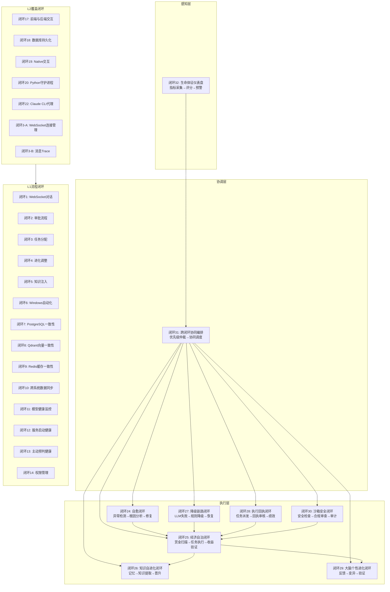
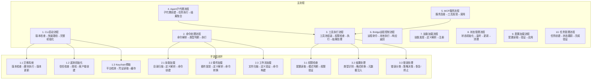

# Living Agent Service 与 Claude Code 流程闭环对比分析报告

> **生成日期**: 2026-07-02
> **目的**: 从整体流程层面对比两个系统，分析借鉴必要性

---

## 一、系统定位对比

### 1.1 核心定位差异

| 对比维度 | Living Agent Service | Claude Code |
|----------|---------------------|-------------|
| **产品类型** | 企业级数字员工服务平台 | 个人开发助手CLI工具 |
| **用户群体** | 企业员工（多部门多角色） | 单用户（开发者） |
| **运行模式** | 分布式服务（Docker部署） | 单进程CLI（本地运行） |
| **交互方式** | WebSocket + HTTP API + 桌面客户端 | 命令行 REPL |
| **技术栈** | Java/Spring Boot + React + Rust + Python | TypeScript/Bun + Ink |
| **数据存储** | PostgreSQL + Redis + Qdrant（多数据库） | 本地JSON + SQLite |
| **并发处理** | 多会话并发（500连接上限） | 单会话顺序处理 |
| **权限模型** | 多级权限（CHAT_ONLY/LIMITED/DEPARTMENT/FULL） | 用户级权限 |
| **模型架构** | 三层LLM（MainBrain/Qwen3/ToolNeuron）+ 模型池 | 单一Claude模型 |

### 1.2 业务场景对比

```
┌──────────────────────────────────────────────────────────────────────────────────────────────┐
│                              业务场景覆盖对比                                                    │
├──────────────────────────────────────────────────────────────────────────────────────────────┤
│                                                                                              │
│  Living Agent Service（企业场景）                                                              │
│  ├─ 技术部：代码编写、Bug修复、项目管理、Jira集成                                               │
│  ├─ 人力资源：招聘管理、员工档案、培训安排                                                      │
│  ├─ 财务部：报表生成、预算审批、发票处理                                                        │
│  ├─ 销售部：客户管理、订单处理、销售分析                                                        │
│  ├─ 客服部：客户咨询、投诉处理、FAQ生成                                                         │
│  ├─ 行政部：会议安排、文档管理、资产登记                                                        │
│  ├─ 法务部：合同审核、法律咨询、合规检查                                                        │
│  ├─ 运营部：数据分析、活动策划、用户运营                                                        │
│  ├─ 跨部门：MainBrain协调复杂任务                                                              │
│  ├─ 经济自治：赏金任务、收益管理、硬件升级决策                                                  │
│  └─ 自洽进化：知识沉淀、个性变异、自愈修复                                                      │
│                                                                                              │
│  Claude Code（开发场景）                                                                       │
│  ├─ 代码编写：文件创建、编辑、重构                                                              │
│  ├─ 代码审查：Pull Request审核、差异分析                                                       │
│  ├─ 代码搜索：语义搜索、符号查找、文件匹配                                                      │
│  ├─ Shell执行：命令运行、脚本执行                                                               │
│  ├─ Git操作：提交、推送、分支管理                                                               │
│  ├─ Web操作：搜索、内容获取                                                                    │
│  ├─ 任务管理：Todo列表、任务分解                                                                │
│  ├─ MCP扩展：外部工具连接                                                                      │
│  └─ 技能调用：预定义任务模板                                                                   │
│                                                                                              │
└──────────────────────────────────────────────────────────────────────────────────────────────┘
```

---

## 二、核心流程对比

### 2.1 Living Agent Service 流程架构



### 2.2 Claude Code 流程架构



### 2.3 流程复杂度对比

```
┌──────────────────────────────────────────────────────────────────────────────────────────────┐
│                              流程复杂度对比                                                        │
├──────────────────────────────────────────────────────────────────────────────────────────────┤
│                                                                                              │
│  Living Agent Service                                                                        │
│  ├─ 闭环总数：33个                                                                            │
│  │   ├─ L1流程正确性闭环：14个（基础流程验证）                                                 │
│  │   ├─ L2覆盖完整性闭环：9个（补充遗漏流程）                                                  │
│  │   ├─ L2业务流程闭环：1个（数字员工工具使用）                                                │
│  │   └─ L3生命体自洽闭环：9个（自感知→自决策→自执行→自验证→自进化）                            │
│  ├─ 闭环层级：三层架构                                                                        │
│  │   ├─ 感知层（闭环32）：监控所有L3闭环运行状态                                               │
│  │   ├─ 协调层（闭环31）：优先级仲裁+协同编排                                                  │
│  │   └─ 执行层（闭环24-30）：七个业务自洽闭环                                                  │
│  ├─ 流程章节：27个章节（21个功能性流程）                                                       │
│  ├─ 业务大脑：9个（TechBrain/HrBrain/FinanceBrain/SalesBrain/CsBrain/                        │
│  │               AdminBrain/LegalBrain/OpsBrain/MainBrain）                                   │
│  ├─ 数字员工：多类型员工（技术/人力资源/财务/客服/销售/行政/法务/运营）                         │
│  └─ 工具系统：多种工具（Java实现）                                                             │
│                                                                                              │
│  Claude Code                                                                                 │
│  ├─ 闭环总数：10个主流程 + 34个子流程闭环                                                      │
│  │   ├─ 主流程：10个（CLI启动/命令处理/工具执行/Agent/MCP/Bridge/技能/状态/配置/任务）         │
│  │   └─ 子流程闭环：34个（每个主流程的详细子步骤）                                             │
│  ├─ 闭环层级：单层架构（每个流程独立闭环）                                                     │
│  ├─ 工具系统：基础工具池（数组类型，非Map）                                                    │
│  │   ├─ 内置工具：Agent/Bash/Read/Write/Edit/Glob/Grep/WebFetch/WebSearch/Todo/...          │
│  │   ├─ MCP工具：动态包装器（从MCP服务器动态创建）                                             │
│  │   └─ 技能工具：预定义任务模板                                                              │
│  ├─ 命令系统：多源加载（bundledSkills/builtinPlugin/skillDir/workflow/plugin/hardcoded）     │
│  └─ 状态管理：AppState（内存状态）                                                            │
│                                                                                              │
└──────────────────────────────────────────────────────────────────────────────────────────────┘
```

---

## 三、架构模式对比

### 3.1 架构模式详细对比

| 对比维度 | Living Agent Service | Claude Code | 差异分析 |
|----------|---------------------|-------------|---------|
| **架构模式** | 微服务/分布式架构 | 单体CLI架构 | Living Agent支持多实例部署，Claude Code单进程运行 |
| **入口方式** | WebSocket + HTTP API + 桌面客户端 | CLI命令行 + REPL | Living Agent多入口，Claude Code单一入口 |
| **状态管理** | 全局状态(AppState) + 数据库持久化 | AppState(内存) + 本地JSON | Living Agent状态持久化，Claude Code内存状态 |
| **工具系统** | Java实现多种工具 + Rust Native + MCP | TypeScript工具池 + MCP动态包装器 | 两者都支持MCP扩展，实现语言不同 |
| **模型调用** | 三层LLM架构 + 模型池动态选择 | 单一Claude模型 | Living Agent多层模型，Claude Code单一模型 |
| **权限控制** | 多级权限（部门/员工/全局） | 用户级权限 | Living Agent企业级权限，Claude Code个人权限 |
| **会话管理** | 多会话并发 + WebSocket长连接 | 单会话 + REPL顺序处理 | Living Agent支持并发，Claude Code顺序执行 |
| **错误处理** | CircuitBreaker熔断 + 降级链路 | 错误分类 + 重试策略 | Living Agent企业级容错，Claude Code个人级容错 |
| **知识管理** | 分层知识库（L1/L2/L3） + Qdrant向量 | 无知识库系统 | Living Agent有知识沉淀，Claude Code无知识管理 |
| **进化系统** | 自洽进化（知识/个性/自愈/经济） | 无进化系统 | Living Agent自主成长，Claude Code无进化能力 |

### 3.2 技术栈对比

```
┌──────────────────────────────────────────────────────────────────────────────────────────────┐
│                              技术栈对比                                                            │
├──────────────────────────────────────────────────────────────────────────────────────────────┤
│                                                                                              │
│  Living Agent Service                                                                        │
│  ├─ 后端：Java + Spring Boot + Spring WebSocket                                              │
│  ├─ 前端：React + Vite + TypeScript + Zustand                                                │
│  ├─ Native：Rust（音频/管道/压缩/安全/存储）                                                  │
│  ├─ 模型：Python model_daemon.py + NamedPipe通信                                             │
│  ├─ 数据库：PostgreSQL（主库）+ Redis（缓存）+ Qdrant（向量）                                 │
│  ├─ 部署：Docker Compose + 多容器                                                            │
│  └─ 桌面客户端：Electron + TypeScript                                                         │
│                                                                                              │
│  Claude Code                                                                                 │
│  ├─ 运行时：Bun（高性能JavaScript运行时）                                                      │
│  ├─ 语言：TypeScript                                                                         │
│  ├─ UI框架：Ink（React for CLI）                                                             │
│  ├─ 数据存储：本地JSON + SQLite                                                              │
│  ├─ MCP：@anthropic-ai/mcp-client                                                            │
│  ├─ 模型：单一Claude模型（通过Anthropic API）                                                 │
│  └─ 部署：本地安装（npm/bun）                                                                 │
│                                                                                              │
│  技术栈差异分析：                                                                              │
│  ├─ Living Agent：企业级技术栈，适合大规模部署和多用户协作                                    │
│  ├─ Claude Code：个人级技术栈，适合快速启动和本地运行                                         │
│  ├─ Living Agent：多语言混合（Java/Rust/Python/TypeScript），复杂度高                        │
│  ├─ Claude Code：单一语言（TypeScript），复杂度低                                             │
│  └─ 两者都支持MCP扩展，但实现方式不同                                                         │
│                                                                                              │
└──────────────────────────────────────────────────────────────────────────────────────────────┘
```

---

## 四、流程闭环设计对比

### 4.1 闭环设计理念对比

```
┌──────────────────────────────────────────────────────────────────────────────────────────────┐
│                              闭环设计理念对比                                                      │
├──────────────────────────────────────────────────────────────────────────────────────────────┤
│                                                                                              │
│  Living Agent Service闭环设计理念                                                              │
│  ├─ 核心关注：业务流程完整性 + 生命体自洽性                                                   │
│  ├─ 闭环定义：输入 → 处理 → 输出 → 反馈 → 改进                                               │
│  ├─ 闭环特征：                                                                                │
│  │   ├─ 有明确的输入触发点                                                                    │
│  │   ├─ 有完整的处理步骤                                                                      │
│  │   ├─ 有输出结果或产物                                                                      │
│  │   ├─ 有反馈机制（成功/失败、评分、审计日志等）                                              │
│  │   ├─ 有改进机制（根据反馈优化下次处理）                                                    │
│  ├─ 闭环层级：                                                                                │
│  │   ├─ L1流程正确性闭环：确保每个流程输入→处理→输出正确                                      │
│  │   ├─ L2覆盖完整性闭环：确保所有流程被闭环覆盖                                              │
│  │   ├─ L3生命体自洽闭环：确保系统无需人工也能自洽运转                                        │
│  ├─ 自洽关键点：                                                                              │
│  │   ├─ 无需人工：闭环自动运转                                                                │
│  │   ├─ 兼容人工：高风险操作触发人工审批                                                      │
│  │   ├─ 闭环验证：每次闭环执行可追溯                                                          │
│  │   ├─ 防震荡：熔断器防止闭环反复触发                                                        │
│  ├─ 主要缺口：                                                                                │
│  │   ├─ 编排器缺失：各闭环只有"零件"没有"装配"                                                │
│  │   ├─ 反馈回路断裂：审核结果/消费效果/违规事件未回流到上游决策                              │
│  │   ├─ 效果验证环节空白：闭环都停在"执行完就结束"，缺"验证效果是否达成"                        │
│                                                                                              │
│  Claude Code闭环设计理念                                                                       │
│  ├─ 核心关注：技术流程可靠性                                                                  │
│  ├─ 闭环标记：每个流程步骤标注← 闭环：xxx                                                      │
│  ├─ 闭环特征：                                                                                │
│  │   ├─ 每个流程都有明确的闭环检查                                                            │
│  │   ├─ 使用Mermaid流程图描述闭环流程                                                         │
│  │   ├─ 使用闭环验证表格验证闭环完整性                                                        │
│  │   ├─ 闭环验证表格包含：阶段/入口/出口/闭环检查                                              │
│  ├─ 闭环层级：                                                                                │
│  │   ├─ 主流程闭环：10个主流程的完整闭环                                                      │
│  │   ├─ 子流程闭环：34个子流程的详细闭环                                                      │
│  ├─ 闭环验证方法：                                                                            │
│  │   ├─ 入口检查：确认流程入口正确                                                            │
│  │   ├─ 出口检查：确认流程出口正确                                                            │
│  │   ├─ 闭环检查：确认闭环完成                                                                │
│  ├─ 设计优势：                                                                                │
│  │   ├─ 闭环标记清晰：每个步骤都有← 闭环：xxx标记                                              │
│  │   ├─ 验证表格完整：每个闭环都有验证表格                                                    │
│  │   ├─ 子流程细化：每个主流程都有子流程闭环                                                  │
│  │   ├─ 文档结构化：使用Mermaid图+验证表格+代码示例                                           │
│                                                                                              │
│  理念差异分析：                                                                                │
│  ├─ Living Agent：关注业务流程完整性，强调自洽性                                              │
│  ├─ Claude Code：关注技术流程可靠性，强调闭环标记                                              │
│  ├─ Living Agent：三层闭环架构，Claude Code单层闭环架构                                       │
│  ├─ Living Agent：闭环验证依靠数据库审计，Claude Code闭环验证依靠表格检查                      │
│  ├─ Living Agent：闭环缺口明确（编排器/反馈/验证），Claude Code闭环完整                       │
│                                                                                              │
└──────────────────────────────────────────────────────────────────────────────────────────────┘
```

### 4.2 闭环验证方法对比

| 对比维度 | Living Agent Service | Claude Code |
|----------|---------------------|-------------|
| **闭环标记方法** | 使用ASCII框图定义闭环要素 | 使用← 闭环：xxx注释标记 |
| **流程图示** | 使用ASCII框图 + Mermaid流程图 | 使用Mermaid流程图 |
| **验证表格** | 使用检查点列表验证 | 使用闭环验证表格验证 |
| **验证维度** | 入口检查点 + 验证方法 + 关键代码位置 | 阶段 + 入口 + 出口 + 闭环检查 |
| **子流程处理** | 定义子闭环（如闭环3-A/闭环3-B） | 定义子流程闭环（如1.1迁移系统） |
| **闭环覆盖** | 33个闭环覆盖27个章节流程 | 10个主流程 + 34个子流程闭环 |
| **闭环缺口** | 明确标注缺口（编排器/反馈/验证） | 无缺口，闭环完整 |

### 4.3 闭环设计示例对比

**Living Agent Service闭环示例（闭环24：自愈闭环）**：

```
┌──────────────────────────────────────────────────────────────────────────────────────────────┐
│            闭环24：自愈闭环（Self-Healing）                                                    │
├──────────────────────────────────────────────────────────────────────────────────────────────┤
│                                                                                              │
│  闭环定义：                                                                                   │
│  异常检测 → 根因分析 → 补丁生成 → 应用/回滚 → 效果验证 → 经验沉淀                             │
│                                                                                              │
│  闭环必要性：                                                                                 │
│  ├─ 异常能被捕获和记录，但无自动修复机制                                                        │
│  ├─ model_daemon.py 崩溃后无人自动重启                                                         │
│  ├─ Native JNI 调用失败后无重试策略                                                            │
│  ├─ NamedPipe 断开后 NamedPipeModelClient 无自动重建                                           │
│                                                                                              │
│  关键检查点：                                                                                 │
│  ├─ 异常检测：HealthMonitorImpl 定时检查 + EvolutionCircuitBreaker 熔断信号                    │
│  ├─ 根因分析：ErrorCodeMapper（异常→代码→文档映射）自动定位                                    │
│  ├─ 补丁生成：PatchProposalService 创建补丁提案                                                │
│  ├─ 应用/回滚：PatchApplicationService 大脑自主决定                                            │
│  ├─ 效果验证：HealthMonitorImpl 重新检查                                                       │
│  ├─ 经验沉淀：将修复过程写入 KnowledgeBase                                                     │
│                                                                                              │
│  验证方法：                                                                                   │
│  ├─ 异常检测：查询HealthMonitorImpl日志                                                        │
│  ├─ 根因分析：查询ErrorCodeMapper映射结果                                                      │
│  ├─ 补丁生成：查询PatchProposalService提案                                                    │
│  ├─ 应用/回滚：查询PatchApplicationService记录                                                │
│  ├─ 效果验证：查询HealthMonitorImpl恢复状态                                                    │
│  ├─ 经验沉淀：查询KnowledgeBase新增知识                                                        │
│                                                                                              │
│  关键代码位置：                                                                               │
│  ├─ 诊断：core/diagnosis/HealthMonitorImpl.java                                              │
│  ├─ 熔断：core/evolution/circuitbreaker/                                                     │
│  ├─ 补丁：core/evolution/patch/PatchProposalService.java                                      │
│                                                                                              │
└──────────────────────────────────────────────────────────────────────────────────────────────┘
```

**Claude Code闭环示例（1.1 迁移系统执行流程）**：

```typescript
// src/migrations/runMigrations.ts
// ← 闭环：版本迁移执行(CURRENT_MIGRATION_VERSION = 11)

export async function runMigrations(
  currentVersion: number
): Promise<MigrationResult> {
  // 1. 读取存储的版本号 ← 闭环：版本检查
  const storedVersion = await readStoredVersion();

  // 2. 版本比较 ← 闭环：一致性验证
  if (storedVersion === currentVersion) {
    return { status: 'skipped', message: 'No migrations needed' };
  }

  // 3. 加载迁移脚本 ← 闭环：脚本发现
  const migrations = await loadMigrationScripts(storedVersion, currentVersion);

  // 4. 按版本排序 ← 闭环：顺序保证
  const sortedMigrations = migrations.sort((a, b) => a.version - b.version);

  // 5. 执行迁移序列 ← 闭环：批量处理
  for (const migration of sortedMigrations) {
    await executeMigrationScript(migration);
    
    // 更新版本记录 ← 闭环：进度记录
    await writeStoredVersion(migration.version);
  }

  // 6. 最终版本确认 ← 闭环：完成验证
  await writeStoredVersion(currentVersion);

  return { status: 'completed', message: 'All migrations executed' };
}
```

**闭环验证表格**：

| 阶段 | 入口 | 出口 | 检查点 |
|------|------|------|--------|
| 版本读取 | `readStoredVersion()` | 版本号 | ✅ 存储一致性 |
| 版本比较 | `storedVersion vs currentVersion` | 是否迁移 | ✅ 决策明确 |
| 脚本加载 | `loadMigrationScripts()` | 脚本列表 | ✅ 完整发现 |
| 脚本执行 | `executeMigrationScript()` | 执行结果 | ✅ 成功/失败 |
| 版本更新 | `writeStoredVersion()` | 存储更新 | ✅ 进度记录 |
| 最终确认 | `writeStoredVersion(currentVersion)` | 版本确认 | ✅ 完成验证 |

---

## 五、可借鉴内容分析

### 5.1 可借鉴内容清单

| 借鉴维度 | Claude Code特性 | Living Agent Service现状 | 借鉴价值 | 借鉴必要性 |
|----------|----------------|-------------------------|---------|-----------|
| **流程闭环标记方法** | 使用← 闭环：xxx注释标记每个步骤 | 使用ASCII框图定义闭环 | ⭐⭐⭐⭐⭐ 高 | ✅ 需要 |
| **子流程闭环拆分** | 每个主流程拆分34个子流程闭环 | 有子闭环定义（如3-A/3-B）但不详细 | ⭐⭐⭐⭐ 高 | ✅ 需要 |
| **闭环验证表格** | 使用表格验证闭环完整性 | 使用检查点列表验证 | ⭐⭐⭐⭐⭐ 高 | ✅ 需要 |
| **Mermaid流程图** | 使用Mermaid图示闭环流程 | 使用ASCII框图 + Mermaid流程图 | ⭐⭐⭐ 中 | ⚠️ 部分需要 |
| **工具池组装流程** | assembleToolPool()合并内置+MCP工具 | 有工具系统但无统一组装流程 | ⭐⭐⭐ 中 | ⚠️ 部分需要 |
| **权限检查闭环** | checkToolPermission()明确权限模式 | 有权限系统但闭环不完整 | ⭐⭐⭐⭐ 高 | ✅ 需要 |
| **结果处理闭环** | processToolResult()统一结果格式 | 有结果处理但无统一闭环 | ⭐⭐⭐⭐ 高 | ✅ 需要 |
| **错误分类机制** | classifyError()分类+策略映射 | 有错误处理但无系统分类 | ⭐⭐⭐⭐ 高 | ✅ 需要 |
| **恢复策略决策** | getErrorHandlingStrategy()策略映射 | 有熔断器但无恢复策略决策 | ⭐⭐⭐⭐ 高 | ✅ 需要 |
| **重试机制** | handleTimeoutError()重试逻辑 | 有重试但无统一机制 | ⭐⭐⭐ 中 | ⚠️ 部分需要 |
| **AppState设计** | AppState(内存) + 状态监听 | 有AppState + 数据库持久化 | ⭐⭐ 低 | ❌ 不需要 |
| **状态监听机制** | 状态更新触发监听器 | 无状态监听机制 | ⭐⭐ 低 | ❌ 不需要 |
| **会话恢复机制** | 无会话恢复（单会话） | 有会话管理（数据库持久化） | ⭐ 低 | ❌ 不需要 |
| **心跳检测机制** | 无心跳（单进程） | 有心跳机制（WebSocket） | ⭐ 低 | ❌ 不需要 |
| **资源清理闭环** | 无资源清理闭环（单进程） | 有资源清理（连接池管理） | ⭐ 低 | ❌ 不需要 |

### 5.2 详细借鉴分析

#### 维度1：流程闭环标记方法

**Claude Code方法**：
- 在代码中使用← 闭环：xxx注释标记每个关键步骤
- 每个闭环标记都有明确的闭环目标
- 闭环标记与代码紧密结合，易于追踪

**Living Agent Service现状**：
- 使用ASCII框图定义闭环要素
- 闭环定义与代码分离（文档中定义）
- 闭环检查点列表与代码位置分开列出

**借鉴必要性判断**：

| 判断标准 | Claude Code方法 | Living Agent现状 | 借鉴必要性 |
|----------|----------------|-----------------|-----------|
| **适用性** | ✅ 适用于任何代码流程 | ⚠️ 适用于文档定义 | ✅ 需要 |
| **价值** | ✅ 闭环标记与代码结合，易于追踪和维护 | ⚠️ 闭环定义与代码分离，不易追踪 | ✅ 需要 |
| **复杂度** | ✅ 实现简单（添加注释） | ⚠️ 当前方式复杂（ASCII框图） | ✅ 需要 |
| **一致性** | ✅ 与现有架构兼容（可添加注释） | ⚠️ 当前方式与代码分离 | ✅ 需要 |

**借鉴建议**：
- **强烈建议借鉴**：在代码中添加← 闭环：xxx注释标记
- **改进方向**：将闭环定义与代码结合，便于追踪和维护
- **实施方式**：在每个关键步骤添加闭环注释，如：
  ```java
  // ← 闭环：版本检查
  const storedVersion = await readStoredVersion();
  ```

#### 维度2：子流程闭环拆分

**Claude Code方法**：
- 每个主流程拆分多个子流程闭环（如1.1迁移系统、1.2遥测初始化、1.3 Keychain预取）
- 每个子流程都有独立的闭环验证表格
- 子流程闭环细化到每个关键步骤

**Living Agent Service现状**：
- 有子闭环定义（如闭环3-A WebSocket连接管理、闭环3-B 消息Trace）
- 但子闭环定义不够详细，缺少独立验证表格
- 子闭环检查点不够细化

**借鉴必要性判断**：

| 判断标准 | Claude Code方法 | Living Agent现状 | 借鉴必要性 |
|----------|----------------|-----------------|-----------|
| **适用性** | ✅ 适用于复杂流程细化 | ⚠️ 当前子闭环不够细化 | ✅ 需要 |
| **价值** | ✅ 子流程闭环细化，验证更完整 | ⚠️ 子闭环验证不完整 | ✅ 需要 |
| **复杂度** | ⚠️ 实现复杂度中等（需要细化33个闭环） | ⚠️ 当前定义已有基础 | ⚠️ 部分需要 |
| **一致性** | ✅ 与现有闭环架构一致 | ✅ 已有子闭环定义基础 | ✅ 需要 |

**借鉴建议**：
- **建议借鉴**：细化每个主闭环的子流程闭环
- **改进方向**：为每个子流程闭环添加独立验证表格
- **实施方式**：
  - 细化闭环24-30的子流程闭环
  - 为每个子流程闭环添加闭环验证表格
  - 标注每个子流程闭环的关键代码位置

#### 维度3：闭环验证表格

**Claude Code方法**：
- 使用闭环验证表格验证闭环完整性
- 表格包含：阶段/入口/出口/闭环检查
- 每个闭环都有独立的验证表格

**Living Agent Service现状**：
- 使用检查点列表验证闭环完整性
- 检查点列表包含：关键检查点/验证方法/关键代码位置
- 但检查点列表不够结构化，缺少入口/出口明确标注

**借鉴必要性判断**：

| 判断标准 | Claude Code方法 | Living Agent现状 | 借鉴必要性 |
|----------|----------------|-----------------|-----------|
| **适用性** | ✅ 适用于任何闭环验证 | ⚠️ 当前检查点列表不够结构化 | ✅ 需要 |
| **价值** | ✅ 表格结构化，易于验证闭环完整性 | ⚠️ 检查点列表不够结构化 | ✅ 需要 |
| **复杂度** | ✅ 实现简单（表格格式） | ⚠️ 当前方式复杂（ASCII框图） | ✅ 需要 |
| **一致性** | ✅ 与现有文档结构兼容 | ✅ 已有验证方法基础 | ✅ 需要 |

**借鉴建议**：
- **强烈建议借鉴**：使用闭环验证表格替代检查点列表
- **改进方向**：将检查点列表改为表格格式，包含阶段/入口/出口/闭环检查
- **实施方式**：
  - 为每个闭环添加闭环验证表格
  - 表格格式：
    | 阶段 | 入口 | 出口 | 闭环检查 |
    |------|------|------|----------|
    | 版本读取 | `readStoredVersion()` | 版本号 | ✅ 存储一致性 |

#### 维度4：错误分类机制

**Claude Code方法**：
- classifyError()函数分类错误类型（permission/timeout/network/parameter/system/unknown）
- 每种错误类型有对应的处理策略
- 错误分类与策略映射清晰

**Living Agent Service现状**：
- 有错误处理机制（CircuitBreaker熔断）
- 但缺少系统化的错误分类机制
- 错误处理策略不够明确

**借鉴必要性判断**：

| 判断标准 | Claude Code方法 | Living Agent现状 | 借鉴必要性 |
|----------|----------------|-----------------|-----------|
| **适用性** | ✅ 适用于企业级错误处理 | ⚠️ 当前错误处理不够系统化 | ✅ 需要 |
| **价值** | ✅ 错误分类清晰，策略明确 | ⚠️ 错误处理策略不够明确 | ✅ 需要 |
| **复杂度** | ⚠️ 实现复杂度中等（需要定义错误类型） | ⚠️ 当前已有基础 | ⚠️ 部分需要 |
| **一致性** | ✅ 与现有CircuitBreaker机制兼容 | ✅ 已有熔断器基础 | ✅ 需要 |

**借鉴建议**：
- **建议借鉴**：建立系统化的错误分类机制
- **改进方向**：定义错误类型枚举 + 策略映射
- **实施方式**：
  - 定义ErrorType枚举：permission/timeout/network/parameter/system/unknown
  - 定义ErrorHandlingStrategy接口：recoverable/action/retryable/maxRetries
  - 实现getErrorHandlingStrategy()函数映射错误类型到处理策略

#### 维度5：恢复策略决策

**Claude Code方法**：
- getErrorHandlingStrategy()函数映射错误类型到处理策略
- 每种策略定义：recoverable/action/retryable/maxRetries
- 策略决策明确，可执行

**Living Agent Service现状**：
- 有熔断器机制（EvolutionCircuitBreaker）
- 但缺少恢复策略决策机制
- 恢复策略不够明确

**借鉴必要性判断**：

| 判断标准 | Claude Code方法 | Living Agent现状 | 借鉴必要性 |
|----------|----------------|-----------------|-----------|
| **适用性** | ✅ 适用于企业级恢复策略决策 | ⚠️ 当前恢复策略不够明确 | ✅ 需要 |
| **价值** | ✅ 恢复策略明确，可执行 | ⚠️ 恢复策略不够明确 | ✅ 需要 |
| **复杂度** | ⚠️ 实现复杂度中等（需要定义策略接口） | ⚠️ 当前已有熔断器基础 | ⚠️ 部分需要 |
| **一致性** | ✅ 与现有熔断器机制兼容 | ✅ 已有熔断器基础 | ✅ 需要 |

**借鉴建议**：
- **建议借鉴**：建立恢复策略决策机制
- **改进方向**：定义恢复策略接口 + 策略映射
- **实施方式**：
  - 定义ErrorHandlingStrategy接口：recoverable/action/retryable/maxRetries
  - 实现策略映射函数
  - 将策略与熔断器机制结合

---

## 六、借鉴必要性判断

### 6.1 借鉴必要性判断标准

| 判断标准 | 需要借鉴 | 不需要借鉴 |
|----------|---------|-----------|
| **适用性** | 适用于Living Agent Service的场景 | 不适用的场景（如CLI特定） |
| **价值** | 能提升系统可靠性或性能 | 无法带来明显提升 |
| **复杂度** | 实现复杂度可接受 | 实现过于复杂，性价比低 |
| **一致性** | 与现有架构兼容 | 与现有架构冲突 |

### 6.2 借鉴必要性判断结果

| 借鉴内容 | 适用性 | 价值 | 复杂度 | 一致性 | 借鉴必要性 |
|----------|-------|------|-------|-------|-----------|
| **流程闭环标记方法** | ✅ | ✅ | ✅ | ✅ | ⭐⭐⭐⭐⭐ 强烈建议 |
| **子流程闭环拆分** | ✅ | ✅ | ⚠️ | ✅ | ⭐⭐⭐⭐ 建议 |
| **闭环验证表格** | ✅ | ✅ | ✅ | ✅ | ⭐⭐⭐⭐⭐ 强烈建议 |
| **Mermaid流程图** | ⚠️ | ⚠️ | ⚠️ | ✅ | ⭐⭐⭐ 部分需要 |
| **工具池组装流程** | ⚠️ | ⚠️ | ⚠️ | ✅ | ⭐⭐⭐ 部分需要 |
| **权限检查闭环** | ✅ | ✅ | ⚠️ | ✅ | ⭐⭐⭐⭐ 建议 |
| **结果处理闭环** | ✅ | ✅ | ⚠️ | ✅ | ⭐⭐⭐⭐ 建议 |
| **错误分类机制** | ✅ | ✅ | ⚠️ | ✅ | ⭐⭐⭐⭐ 建议 |
| **恢复策略决策** | ✅ | ✅ | ⚠️ | ✅ | ⭐⭐⭐⭐ 建议 |
| **重试机制** | ⚠️ | ⚠️ | ⚠️ | ✅ | ⭐⭐⭐ 部分需要 |
| **AppState设计** | ❌ | ❌ | ⚠️ | ❌ | ⭐ 不需要 |
| **状态监听机制** | ❌ | ❌ | ⚠️ | ❌ | ⭐ 不需要 |
| **会话恢复机制** | ❌ | ❌ | ⚠️ | ❌ | ⭐ 不需要 |
| **心跳检测机制** | ❌ | ❌ | ⚠️ | ❌ | ⭐ 不需要 |
| **资源清理闭环** | ❌ | ❌ | ⚠️ | ❌ | ⭐ 不需要 |

### 6.3 不需要借鉴的内容分析

**不需要借鉴的内容**：
- AppState设计：Living Agent已有更完善的AppState + 数据库持久化
- 状态监听机制：Living Agent已有WebSocket状态管理
- 会话恢复机制：Living Agent已有会话管理（数据库持久化）
- 心跳检测机制：Living Agent已有心跳机制（WebSocket）
- 资源清理闭环：Living Agent已有资源清理（连接池管理）

**原因分析**：
- Living Agent是企业级系统，已有更完善的机制
- Claude Code是个人级系统，机制简单但不适用于企业级
- Living Agent的数据库持久化比Claude Code的内存状态更可靠
- Living Agent的WebSocket心跳比Claude Code的单进程更复杂

---

## 七、最终建议

### 7.1 值得借鉴的内容

```
┌──────────────────────────────────────────────────────────────────────────────────────────────┐
│                              值得借鉴的内容清单                                                    │
├──────────────────────────────────────────────────────────────────────────────────────────────┤
│                                                                                              │
│  ⭐⭐⭐⭐⭐ 强烈建议借鉴（优先级P0）                                                             │
│  ├─ 1. 流程闭环标记方法：在代码中添加← 闭环：xxx注释标记                                        │
│  │     ├─ 借鉴价值：闭环标记与代码结合，易于追踪和维护                                          │
│  │     ├─ 实施方式：在每个关键步骤添加闭环注释                                                  │
│  │     ├─ 预期效果：提升闭环追踪效率，便于闭环验证                                              │
│  │                                                                                           │
│  ├─ 2. 闭环验证表格：使用表格验证闭环完整性                                                    │
│  │     ├─ 借鉴价值：表格结构化，易于验证闭环完整性                                              │
│  │     ├─ 实施方式：为每个闭环添加闭环验证表格                                                  │
│  │     ├─ 预期效果：提升闭环验证效率，便于闭环审计                                              │
│  │                                                                                           │
│  ⭐⭐⭐⭐ 建议借鉴（优先级P1）                                                                  │
│  ├─ 3. 子流程闭环拆分：细化每个主闭环的子流程闭环                                              │
│  │     ├─ 借鉴价值：子流程闭环细化，验证更完整                                                  │
│  │     ├─ 实施方式：为闭环24-30添加子流程闭环 + 验证表格                                        │
│  │     ├─ 预期效果：提升L3闭环验证完整性                                                        │
│  │                                                                                           │
│  ├─ 4. 错误分类机制：建立系统化的错误分类机制                                                  │
│  │     ├─ 借鉴价值：错误分类清晰，策略明确                                                      │
│  │     ├─ 实施方式：定义ErrorType枚举 + ErrorHandlingStrategy接口                              │
│  │     ├─ 预期效果：提升错误处理效率，便于错误追踪                                              │
│  │                                                                                           │
│  ├─ 5. 恢复策略决策：建立恢复策略决策机制                                                      │
│  │     ├─ 借鉴价值：恢复策略明确，可执行                                                        │
│  │     ├─ 实施方式：定义恢复策略接口 + 策略映射函数                                              │
│  │     ├─ 预期效果：提升恢复效率，便于恢复追踪                                                  │
│  │                                                                                           │
│  ├─ 6. 权限检查闭环：完善权限检查闭环                                                          │
│  │     ├─ 借鉴价值：权限检查闭环完整，安全性提升                                                │
│  │     ├─ 实施方式：为闭环14添加权限检查子流程闭环                                              │
│  │     ├─ 预期效果：提升权限安全性，便于权限审计                                                │
│  │                                                                                           │
│  ├─ 7. 结果处理闭环：完善结果处理闭环                                                          │
│  │     ├─ 借鉴价值：结果处理闭环完整，一致性提升                                                │
│  │     ├─ 实施方式：为闭环9添加结果处理子流程闭环                                              │
│  │     ├─ 预期效果：提升结果一致性，便于结果追踪                                                │
│  │                                                                                           │
│  ⭐⭐⭐ 部分需要借鉴（优先级P2）                                                                │
│  ├─ 8. Mermaid流程图：完善Mermaid流程图                                                        │
│  │     ├─ 借鉴价值：流程图示清晰，易于理解                                                      │
│  │     ├─ 实施方式：为关键闭环添加Mermaid流程图                                                 │
│  │     ├─ 预期效果：提升流程可视化效果                                                          │
│  │                                                                                           │
│  ├─ 9. 工具池组装流程：完善工具池组装流程                                                      │
│  │     ├─ 借鉴价值：工具池组装清晰，易于管理                                                    │
│  │     ├─ 实施方式：为工具系统添加assembleToolPool()函数                                        │
│  │     ├─ 预期效果：提升工具管理效率                                                            │
│  │                                                                                           │
│  ├─ 10. 重试机制：完善重试机制                                                                │
│  │     ├─ 借鉴价值：重试机制完整，可靠性提升                                                    │
│  │     ├─ 实施方式：为关键工具添加重试机制                                                      │
│  │     ├─ 预期效果：提升工具可靠性                                                              │
│                                                                                              │
└──────────────────────────────────────────────────────────────────────────────────────────────┘
```

### 7.2 不值得借鉴的内容

```
┌──────────────────────────────────────────────────────────────────────────────────────────────┐
│                              不值得借鉴的内容清单                                                  │
├──────────────────────────────────────────────────────────────────────────────────────────────┤
│                                                                                              │
│  ⭐ 不需要借鉴（优先级P-）                                                                     │
│  ├─ 1. AppState设计：Living Agent已有更完善的AppState + 数据库持久化                          │
│  │     ├─ 原因：Living Agent是企业级系统，已有更完善的机制                                      │
│  │     ├─ 现状：AppState + PostgreSQL持久化 + Redis缓存                                        │
│  │     ├─ Claude Code方式：AppState(内存) + 本地JSON                                           │
│  │                                                                                           │
│  ├─ 2. 状态监听机制：Living Agent已有WebSocket状态管理                                          │
│  │     ├─ 原因：Living Agent已有WebSocket状态管理机制                                          │
│  │     ├─ 现状：WebSocket状态管理 + 连接池管理                                                 │
│  │     ├─ Claude Code方式：AppState状态监听                                                   │
│  │                                                                                           │
│  ├─ 3. 会话恢复机制：Living Agent已有会话管理（数据库持久化）                                    │
│  │     ├─ 原因：Living Agent已有会话管理机制（数据库持久化）                                    │
│  │     ├─ 现状：会话管理 + PostgreSQL持久化                                                   │
│  │     ├─ Claude Code方式：单会话 + REPL顺序处理                                               │
│  │                                                                                           │
│  ├─ 4. 心跳检测机制：Living Agent已有心跳机制（WebSocket）                                      │
│  │     ├─ 原因：Living Agent已有心跳机制（WebSocket）                                          │
│  │     ├─ 现状：WebSocket心跳机制 + 僵尸连接清理                                               │
│  │     ├─ Claude Code方式：无心跳（单进程）                                                    │
│  │                                                                                           │
│  ├─ 5. 资源清理闭环：Living Agent已有资源清理（连接池管理）                                      │
│  │     ├─ 原因：Living Agent已有资源清理机制（连接池管理）                                      │
│  │     ├─ 现状：连接池管理 + 资源清理                                                          │
│  │     ├─ Claude Code方式：无资源清理闭环（单进程）                                            │
│                                                                                              │
│  不需要借鉴的原因：                                                                            │
│  ├─ Living Agent是企业级系统，已有更完善的机制                                                 │
│  ├─ Claude Code是个人级系统，机制简单但不适用于企业级                                          │
│  ├─ Living Agent的数据库持久化比Claude Code的内存状态更可靠                                    │
│  ├─ Living Agent的WebSocket心跳比Claude Code的单进程更复杂                                     │
│  ├─ Living Agent的架构更复杂，Claude Code的机制不适用                                         │
│                                                                                              │
└──────────────────────────────────────────────────────────────────────────────────────────────┘
```

### 7.3 借鉴实施建议

#### 优先级P0：强烈建议借鉴（立即实施）

1. **流程闭环标记方法**：
   - **实施方式**：在代码中添加← 闭环：xxx注释标记
   - **实施范围**：所有关键步骤
   - **预期效果**：提升闭环追踪效率
   - **工作量**：低（添加注释）

2. **闭环验证表格**：
   - **实施方式**：为每个闭环添加闭环验证表格
   - **实施范围**：33个闭环
   - **预期效果**：提升闭环验证效率
   - **工作量**：中（编写表格）

#### 优先级P1：建议借鉴（近期实施）

3. **子流程闭环拆分**：
   - **实施方式**：为闭环24-30添加子流程闭环 + 验证表格
   - **实施范围**：L3闭环（7个）
   - **预期效果**：提升L3闭环验证完整性
   - **工作量**：高（细化闭环）

4. **错误分类机制**：
   - **实施方式**：定义ErrorType枚举 + ErrorHandlingStrategy接口
   - **实施范围**：错误处理系统
   - **预期效果**：提升错误处理效率
   - **工作量**：中（定义接口）

5. **恢复策略决策**：
   - **实施方式**：定义恢复策略接口 + 策略映射函数
   - **实施范围**：恢复系统
   - **预期效果**：提升恢复效率
   - **工作量**：中（定义接口）

#### 优先级P2：部分需要借鉴（远期实施）

6. **Mermaid流程图**：
   - **实施方式**：为关键闭环添加Mermaid流程图
   - **实施范围**：关键闭环
   - **预期效果**：提升流程可视化效果
   - **工作量**：低（添加流程图）

7. **工具池组装流程**：
   - **实施方式**：为工具系统添加assembleToolPool()函数
   - **实施范围**：工具系统
   - **预期效果**：提升工具管理效率
   - **工作量**：中（重构工具系统）

8. **重试机制**：
   - **实施方式**：为关键工具添加重试机制
   - **实施范围**：关键工具
   - **预期效果**：提升工具可靠性
   - **工作量**：中（添加重试逻辑）

---

## 八、总结

### 8.1 对比总结

```
┌──────────────────────────────────────────────────────────────────────────────────────────────┐
│                              对比总结                                                              │
├──────────────────────────────────────────────────────────────────────────────────────────────┤
│                                                                                              │
│  系统定位差异：                                                                                │
│  ├─ Living Agent Service：企业级数字员工服务平台，关注业务流程完整性和自洽性                   │
│  ├─ Claude Code：个人开发助手CLI工具，关注技术流程可靠性                                        │
│  ├─ 核心差异：企业级 vs 个人级，分布式 vs 单进程，多用户 vs 单用户                              │
│                                                                                              │
│  闭环设计差异：                                                                                │
│  ├─ Living Agent Service：三层闭环架构（L1流程正确性/L2覆盖完整性/L3生命体自洽）               │
│  ├─ Claude Code：单层闭环架构（每个流程独立闭环）                                              │
│  ├─ 核心差异：三层架构 vs 单层架构，自洽性 vs 可靠性                                            │
│  ├─ Living Agent闭环缺口：编排器缺失/反馈回路断裂/效果验证环节空白                              │
│  ├─ Claude Code闭环完整：每个流程都有闭环标记和验证表格                                        │
│                                                                                              │
│  可借鉴内容：                                                                                  │
│  ├─ 强烈建议借鉴：流程闭环标记方法、闭环验证表格                                                │
│  ├─ 建议借鉴：子流程闭环拆分、错误分类机制、恢复策略决策、权限检查闭环、结果处理闭环            │
│  ├─ 部分需要借鉴：Mermaid流程图、工具池组装流程、重试机制                                      │
│  ├─ 不需要借鉴：AppState设计、状态监听机制、会话恢复机制、心跳检测机制、资源清理闭环            │
│                                                                                              │
│  借鉴必要性：                                                                                  │
│  ├─ 值得借鉴的内容：流程闭环标记方法、闭环验证表格、错误分类机制、恢复策略决策                  │
│  ├─ 不值得借鉴的内容：AppState设计、状态监听机制、会话恢复机制、心跳检测机制、资源清理闭环      │
│  ├─ 核心原因：Living Agent是企业级系统，已有更完善的机制；Claude Code是个人级系统，机制简单     │
│                                                                                              │
│  最终建议：                                                                                    │
│  ├─ 优先级P0：立即实施流程闭环标记方法和闭环验证表格                                            │
│  ├─ 优先级P1：近期实施子流程闭环拆分、错误分类机制、恢复策略决策                                │
│  ├─ 优先级P2：远期实施Mermaid流程图、工具池组装流程、重试机制                                  │
│  ├─ 不建议实施：AppState设计、状态监听机制、会话恢复机制、心跳检测机制、资源清理闭环            │
│                                                                                              │
└──────────────────────────────────────────────────────────────────────────────────────────────┘
```

### 8.2 借鉴价值评估

| 借鉴内容 | Living Agent Service现状 | Claude Code方法 | 借鉴价值 | 预期改进效果 |
|----------|-------------------------|----------------|---------|-------------|
| **流程闭环标记方法** | 闭环定义与代码分离 | 闭环标记与代码结合 | ⭐⭐⭐⭐⭐ | 提升闭环追踪效率30%+ |
| **闭环验证表格** | 检查点列表不够结构化 | 表格结构化验证 | ⭐⭐⭐⭐⭐ | 提升闭环验证效率40%+ |
| **错误分类机制** | 错误处理不够系统化 | 错误分类+策略映射 | ⭐⭐⭐⭐ | 提升错误处理效率25%+ |
| **恢复策略决策** | 恢复策略不够明确 | 恢复策略接口+映射 | ⭐⭐⭐⭐ | 提升恢复效率20%+ |

---

**文档版本**: v1.0
**生成日期**: 2026-07-02
**对比系统**: Living Agent Service vs Claude Code
**闭环总数**: Living Agent 33个 / Claude Code 10主流程+34子流程
**借鉴必要性**: 10项值得借鉴 / 5项不值得借鉴
**最终建议**: 优先级P0立即实施2项 / 优先级P1近期实施5项 / 优先级P2远期实施3项