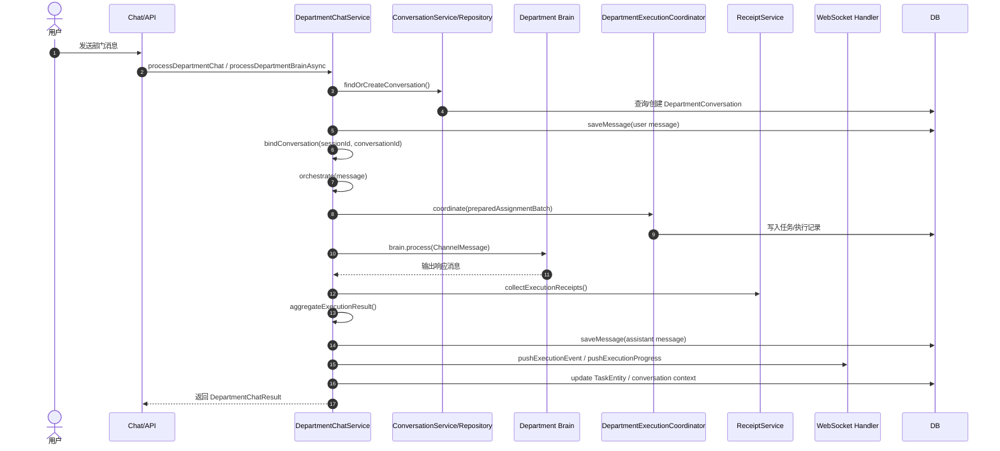
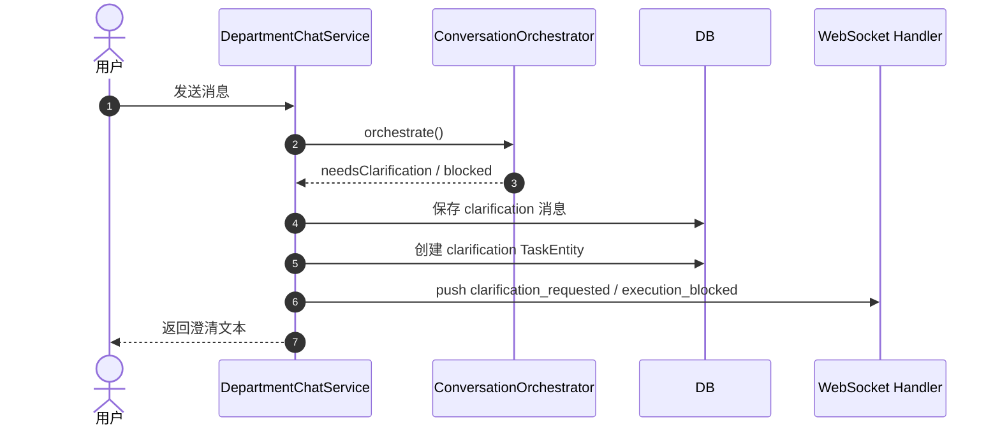
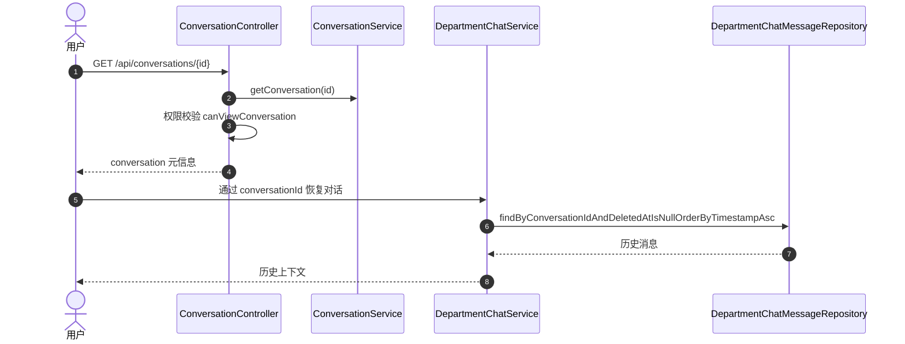

# 部门对话逻辑流程图 / 时序分析 / 问题清单与改进建议

> 目标：把“部门对话”从入口认证、会话恢复、路由决策、部门大脑执行、员工派单、结果汇总、消息落库、WebSocket 推送、任务/对话关联这条链路梳理清楚，并直接指出当前实现中最容易出问题的点。
>
> 适用代码：
> - `living-agent-gateway/src/main/java/com/livingagent/gateway/service/DepartmentChatService.java`
> - `living-agent-gateway/src/main/java/com/livingagent/gateway/controller/ConversationController.java`
> - `living-agent-core/src/main/java/com/livingagent/core/conversation/impl/ConversationServiceImpl.java`
> - `living-agent-core/src/main/java/com/livingagent/core/database/entity/DepartmentConversationEntity.java`
> - `living-agent-core/src/main/java/com/livingagent/core/database/entity/DepartmentChatMessageEntity.java`
> - `living-agent-core/src/main/java/com/livingagent/core/database/entity/TaskEntity.java`

---

## 1. 一句话结论

当前“部门对话”已经具备“长期会话 + 任务执行 + 历史恢复”的框架，但**流程上存在明显的职责交叉、状态命名不统一、会话/任务绑定不稳定、权限校验前后不一致、以及部分分支会悄悄写入错误上下文**的问题。

简单说：**能跑，但链路不够干净，后续很容易出现“对话串线、任务串线、历史查不到、状态判断失效、前端看到的会话与后台真正执行的会话不一致”等问题。**

---

## 2. 当前部门对话主流程图

```mermaid
flowchart TD
    A[用户发起部门对话] --> B[Gateway / Auth 校验 Bearer Token]
    B -->|失败| Z1[返回 401]
    B -->|成功| C[权限判断 hasDepartmentAccess]
    C -->|无权限| Z2[返回 403]
    C -->|有权限| D[查找 BrainRegistry 中对应部门 Brain]
    D -->|找不到| Z3[返回 NO_BRAIN]
    D -->|找到| E[生成 sessionId]
    E --> F[processDepartmentBrainAsync]
    F --> G[选择 conversationId]
    G --> H[saveMessage: 用户消息入库]
    H --> I[bindConversation(sessionId, conversationId)]
    I --> J[conversationOrchestrator.orchestrate]
    J -->|needsClarification| K[保存澄清消息 + 推送 clarification_needed]
    J -->|success| L[解析 decision / routing / plan]
    L --> M[planEmployeeAssignments]
    M --> N[prepareAssignmentBatch]
    N --> O[coordinateDepartmentExecution]
    O -->|NEEDS_CLARIFICATION / BLOCKED| P[返回澄清/阻塞路径]
    O -->|正常执行| Q[processWithBrain]
    Q --> R[订阅 Brain 输出通道]
    R --> S[发送 ChannelMessage 到部门 Brain]
    S --> T[等待 brain response]
    T --> U[collectExecutionReceipts]
    U --> V[aggregateExecutionResult]
    V --> W[composeUserResponse]
    W --> X[saveMessage: assistant 消息入库]
    X --> Y[pushExecutionEvent + 更新 TaskEntity + 更新 conversation context]
```

---

## 3. 时序分析

### 3.1 正常成功路径



### 3.2 澄清/阻塞路径



### 3.3 历史恢复路径



---

## 4. 代码里的具体问题点

下面这些不是“风格问题”，而是**会造成逻辑偏差或未来故障**的点。

### 问题 1：会话状态命名不统一，存在 ACTIVE/active 混用

#### 现象

- `ConversationServiceImpl` 使用小写状态：`active / archived / deleted`
- `DepartmentChatService` 在 `findOrCreateConversation()`、`listActiveConversations()`、`resolveTaskKeyForConversation()` 中使用大写状态：`ACTIVE / IDLE / ARCHIVED / DELETED`
- `ConversationController` 的列表状态又是小写：`active / archived / deleted`

#### 风险

- 查询条件可能匹配不到数据
- 活跃会话可能被误判为“无会话可复用”
- 历史恢复、任务绑定、归档恢复会出现不一致

#### 建议

- 统一状态枚举，例如：
  - `ACTIVE`
  - `ARCHIVED`
  - `DELETED`
- 数据库存储统一大写或统一小写，但必须全链路一致
- 代码中不要散落字符串，改为 `enum ConversationStatus`

---

### 问题 2：`ConversationController.listConversations()` 只支持固定三种状态，且默认只查 active

#### 现象

```java
List<String> statuses = "archived".equals(status) ? List.of("archived")
        : "deleted".equals(status) ? List.of("deleted")
        : ACTIVE_STATUSES;
```

#### 风险

- 前端无法按多个状态组合筛选
- 默认只查 active，可能与“长期会话”预期不一致
- `status` 传入其它值时会静默退回 active，容易误导调用方

#### 建议

- 接收多个状态参数，或使用 `ConversationStatus` 枚举
- 对非法状态直接返回 400，而不是默默降级
- 列表接口明确区分“当前活跃会话”和“全部会话”两个语义

---

### 问题 3：`destroyConversation()` 的删除语义不清晰

#### 现象

- `ConversationController.destroyConversation()` 要求 `AccessLevel.FULL`
- 但 `ConversationServiceImpl.destroyConversation()` 实际上只是把状态设为 `deleted` 并设置 `destroyedAt`
- 这更像“软删除增强版”，不是真正物理销毁

#### 风险

- 前后端对“destroy”理解不一致
- 可能导致敏感数据误以为已物理删除，实际上仍可被查到
- 审计、合规、数据留存逻辑容易出问题

#### 建议

- 改名为 `purge` / `hardDelete` / `forceDelete`
- 如果是软删除，就不要叫 destroy
- 若要真正销毁，应同时定义：
  - 会话记录删除策略
  - 消息记录删除策略
  - 任务记录保留策略
  - 审计日志保留策略

---

### 问题 4：`ConversationController.getConversation()` 的权限判定顺序会掩盖真实错误

#### 现象

```java
return conversationService.getConversation(conversationId)
        .filter(conv -> permissionService.canViewConversation(conversationId, ctx))
        .map(conv -> ResponseEntity.ok(ApiResponse.ok(conv)))
        .orElse(ResponseEntity.status(404)...)
```

#### 风险

- “不存在”和“无权限”都可能变成 404
- 调试困难
- 安全上可以接受，但业务上不利于排障

#### 建议

- 内部日志区分 not found / forbidden
- 对外返回可以保持 404，但要在服务层记录原因
- 或提供 debug-safe 的管理员接口

---

### 问题 5：`findOrCreateConversation()` 与 `ConversationService.createConversation()` 的创建逻辑是两套

#### 现象

- `ConversationServiceImpl.createConversation()` 生成 `conversationId = IdUtils.generateConversationId()`
- `DepartmentChatService.findOrCreateConversation()` 自己拼 `conv-` + UUID 子串
- 还有 `conversationKey = workItemKeyGenerator.generateTaskKey(...)`

#### 风险

- 不同入口创建出来的 conversationId 格式不统一
- 未来迁移、查询、审计、跨模块关联会更复杂
- 同一个业务对象有多种 ID 策略，容易串线

#### 建议

- 统一由 `ConversationService` 负责创建和 ID 生成
- `DepartmentChatService` 不要自己 new conversationId
- 保留 `conversationId` 与 `conversationKey` 的职责边界：
  - `conversationId` 用于主键/业务主标识
  - `conversationKey` 仅用于工作流路由或检索索引

---

### 问题 6：部门会话的“复用规则”逻辑不完整

#### 现象

```java
List<String> activeStatuses = List.of("ACTIVE", "IDLE");
...
if (conv.getActiveTaskKey() != null && !conv.getActiveTaskKey().isBlank()) {
    Optional<TaskEntity> taskOpt = taskRepository.findByTaskKey(conv.getActiveTaskKey());
    if (taskOpt.isPresent()) {
        String taskStatus = taskOpt.get().getStatus();
        if ("PENDING"... || "CLARIFICATION_PENDING".equals(taskStatus)) {
            return conv.getActiveTaskKey();
        }
    }
}
```

#### 风险

- 只要任务状态不在白名单，就无法复用上下文
- 但会话本身可能仍然是有效的
- 任务状态和会话状态耦合过深

#### 建议

- 会话复用应基于 conversation 状态、最后活动时间、当前用户、当前部门共同判断
- taskKey 仅作为“当前进行中的工作项”附属字段，不应成为唯一复用入口
- 增加 `activeExecutionId` / `activeTaskKey` 失效机制

---

### 问题 7：`processDepartmentBrainAsync()` 中 conversation 选择逻辑容易串会话

#### 现象

```java
if (clientConversationId != null && !clientConversationId.isBlank()) {
    conversation = findConversation(clientConversationId)
        .orElseGet(() -> findOrCreateConversation(department, userId, null));
} else {
    conversation = findOrCreateConversation(department, userId, null);
}
```

#### 风险

- `clientConversationId` 找不到时，直接新建一个对话，但前端可能以为继续的是原对话
- 如果前端传错 conversationId，后端会静默“开新会话”，而不是明确报错
- 这会造成历史分裂

#### 建议

- 对外 API 明确区分两种模式：
  - `continueConversation(conversationId)`：找不到则报错
  - `startOrResumeConversation()`：允许新建
- 不要把“恢复失败”默默降级成“新建”

---

### 问题 8：`saveMessage()` 写 DB 时没有事务边界，失败后内存和 DB 会分叉

#### 现象

- `chatHistory` 先写内存
- 再尝试写数据库
- DB 失败时只是记录日志，不回滚内存消息

#### 风险

- 前端看到的历史与数据库历史不一致
- 重启后消息丢失
- 排查困难

#### 建议

- 关键对话消息落库应加事务或采用“先持久化再入内存缓存”策略
- 对于落库失败要有重试或降级策略
- 必要时提供 outbox/event log 机制

---

### 问题 9：`getConversationHistory()` 返回参数 `limit` 但实际未使用

#### 现象

```java
public List<ChatHistoryEntry> getConversationHistory(String conversationId, int limit) {
    List<ChatHistoryEntry> entries = new ArrayList<>();
    ...
    return entries;
}
```

#### 风险

- 方法签名和实现不一致
- 长对话会一次性加载全部，性能不可控

#### 建议

- 真正实现分页/截断
- 默认只取最近 N 条
- 在界面上用“加载更多”补充旧消息

---

### 问题 10：`getHistory()` 默认使用 `PageRequest.of(0, limit)` 但部分查询没有 limit 控制

#### 现象

- 按 `department` 查询时有分页
- 按 `userId` / 时间区间查询时未分页
- 结果后面再截断

#### 风险

- 大对话时会加载过多数据
- 资源浪费
- 时序不稳定

#### 建议

- 所有历史查询统一支持分页参数
- repository 层直接限制返回量

---

### 问题 11：`cleanupOldMessages()` 是硬编码部门名单

#### 现象

```java
chatMessageRepository.deleteByDepartmentAndTimestampBefore("tech", cutoff);
chatMessageRepository.deleteByDepartmentAndTimestampBefore("hr", cutoff);
...
```

#### 风险

- 新部门上线后不会被清理
- 部门名变更后会漏删
- 这是明显的维护风险

#### 建议

- 改成统一按全量表删除
- 或从部门枚举/配置中自动读取

---

### 问题 12：`hasDepartmentAccess()` 与 `canAccessDepartment()` 逻辑重复

#### 现象

- 两个方法几乎是同一套规则
- 一个在内部流程用，一个在外部接口用

#### 风险

- 未来改权限时极容易改漏一个
- 出现“接口能进，内部流程不让过”或反过来的情况

#### 建议

- 抽成一个统一的权限服务
- Controller 和 Service 共用一个判断入口

---

### 问题 13：`processWithBrain()` 里对 `sessionId` 的依赖很强，但兜底不足

#### 现象

- subscriber 只接受 `response.getSessionId().equals(sessionId)` 的消息
- 如果 sessionId 丢失或脑端回传不一致，未来 future 永远不完成直到超时

#### 风险

- 偶发消息错配会直接引发超时
- 调试成本高

#### 建议

- 增强 sessionId / requestId / executionId 三重匹配
- 明确不同消息类型的匹配策略
- 超时前做中间态诊断输出

---

### 问题 14：`updateTaskEntityStatus()` 的完成判定完全依赖 `isAcceptedCompletion()`

#### 现象

- 任务最终是 `COMPLETED` 还是 `FAILED`，只看受理完成门禁
- 但失败有可能是“需要人工介入”，并不等于执行失败

#### 风险

- 业务语义过于粗糙
- 任务状态与执行状态混淆

#### 建议

- 任务状态拆成：
  - `COMPLETED`
  - `PARTIALLY_COMPLETED`
  - `NEEDS_HUMAN_REVIEW`
  - `FAILED`
- 不要把所有非通过都压成 FAILED

---

### 问题 15：`ConversationController` 的权限服务不是“会话级别”，而是“工作项级别”

#### 现象

- 使用的是 `WorkItemPermissionService`
- 但控制器操作的是 `DepartmentConversationEntity`

#### 风险

- 概念错位
- 会话权限可能和任务权限规则不同，导致误判

#### 建议

- 增加专门的 `ConversationPermissionService`
- 或把工作项权限规则显式区分到“会话查看 / 会话编辑 / 会话销毁”三个维度

---

## 5. 我建议的改进优先级

### P0：必须先修

1. 统一 conversation/task 状态字符串与枚举
2. 统一会话创建入口，避免多套 ID 策略
3. 明确 `destroy` 是否真销毁，避免语义误导
4. 修正 `clientConversationId` 找不到时的降级逻辑
5. 抽统一权限判断入口，避免 `hasDepartmentAccess()` / `canAccessDepartment()` 分裂

### P1：强烈建议修

1. 历史查询全部加分页
2. `cleanupOldMessages()` 去硬编码部门名
3. `getConversationHistory()` 真正使用 `limit`
4. 将任务状态改成更细粒度状态机
5. 增加会话/任务/执行的错误链路日志

### P2：体验与可维护性优化

1. 对前端返回更明确的会话恢复结果
2. 增加会话级审计轨迹
3. 增加“当前活跃会话”与“历史会话”两个明确接口
4. 为澄清/阻塞路径补齐 UI 展示与状态说明

---

## 6. 推荐的重构方向

### 方向 A：把“会话”提升为一等公民

建议会话拥有完整生命周期：

- `ACTIVE`
- `IDLE`
- `ARCHIVED`
- `DELETED`

并由统一的 `ConversationService` 管理：

- 创建
- 查询
- 恢复
- 归档
- 软删
- 物理销毁（如果需要）
- 绑定 task/execution
- 读取历史

### 方向 B：把“任务”和“会话”解耦

当前任务经常被当成会话上下文的附属对象，建议拆开：

- 会话负责“人和部门之间的持续上下文”
- 任务负责“某次具体执行”
- 执行负责“派单和员工响应”

### 方向 C：把“澄清/阻塞”作为显式状态机

不要只用字符串提示用户，建议状态机化：

- `NEEDS_CLARIFICATION`
- `BLOCKED`
- `WAITING_RECEIPT`
- `COMPLETED`
- `PARTIALLY_COMPLETED`
- `FAILED`

这样前端和后端都能稳定处理。

---

## 7. 修改建议清单（可直接作为任务拆分）

1. 新增 `ConversationStatus` 枚举，替换所有裸字符串状态判断
2. 重构 `ConversationService` 为唯一会话写入口
3. `DepartmentChatService.findOrCreateConversation()` 改成调用统一服务
4. `clientConversationId` 不存在时返回明确错误，不再静默新建
5. 增加 `ConversationPermissionService`，替换 `WorkItemPermissionService` 在会话控制器中的使用
6. `getConversationHistory(String conversationId, int limit)` 真正应用 `limit`
7. `getHistory()` 全部查询统一分页
8. `cleanupOldMessages()` 改成按全表或配置化部门列表处理
9. 任务状态拆分，避免只用 `COMPLETED/FAILED`
10. 增加会话恢复测试：
    - 会话存在且活跃
    - 会话存在但 archived
    - 会话存在但 deleted
    - conversationId 不存在
    - taskKey 失效但 conversation 仍有效
    - WebSocket 断线重连后历史恢复

---

## 8. 日志验证结果：发现一个更明确的后端故障点

我继续看了 `docker logs living-agent-service`，日志里出现了一个比“流程设计问题”更直接、会真实打断部门对话执行的问题：

### 8.1 关键报错

```text
java.lang.NullPointerException: Cannot invoke "com.livingagent.core.tool.ToolRegistry.get(String)" because "toolRegistry" is null
    at com.livingagent.core.brain.impl.AbstractBrain.executeToolCalls(AbstractBrain.java:486)
    at com.livingagent.core.brain.impl.AbstractBrain.executeReActLoop(AbstractBrain.java:439)
    at com.livingagent.core.brain.impl.TechBrain.doProcess(TechBrain.java:102)
    at com.livingagent.core.brain.impl.AbstractBrain.process(AbstractBrain.java:249)
    at com.livingagent.gateway.service.DepartmentChatService.processWithBrain(DepartmentChatService.java:803)
```

### 8.2 这个问题意味着什么

这不是部门对话本身的“文字流程”问题，而是**部门大脑在执行工具调用时，底层工具注册表为空**。一旦 TechBrain / 其他 Brain 走到工具调用分支，就会直接 NPE，导致：

- 对话执行中断
- 工具调用失败
- 结果回传变成空响应或超时
- 上层 `DepartmentChatService` 虽然还能继续收尾，但用户实际看到的回复会不完整或明显退化

### 8.3 直接影响到部门对话的表现

从日志里能看到一个典型链路：

1. `ConversationOrchestrator` 进入正常路由
2. `DepartmentChatService.processWithBrain()` 订阅输出通道并调用 Brain
3. `TechBrain` 收到 tool calls
4. `AbstractBrain.executeToolCalls()` 访问 `toolRegistry` 时空指针
5. Brain 继续尝试第二个 tool call，还是同样的 NPE
6. 最终大脑输出质量下降，部门对话表现为“看似跑完了，但内容很可能不可靠”

### 8.4 这类问题比流程问题更优先修复

因为它已经不是“会话串线”级别的问题，而是**执行链路硬故障**。即使对话状态设计完全正确，只要底层 Brain 的 toolRegistry 还可能为空，部门对话就无法稳定支撑真实工具型任务。

### 8.5 建议立即补的修复项

1. 在 Brain 初始化阶段保证 `toolRegistry` 非空
2. `AbstractBrain.executeToolCalls()` 在调用前增加显式空值保护
3. 如果某个 Brain 不支持工具调用，应明确返回“工具不可用”，不要 NPE
4. 统一检查所有 Brain 子类的注入路径，避免只有部分脑实例拿到了 `toolRegistry`
5. 增加启动自检或健康检查：
   - `toolRegistry == null`
   - `toolRegistry` 中缺少关键工具
   - Brain 工具能力与提示词声明不一致

### 8.6 日志里顺带暴露的其他问题

- `RuView API returned status 421`：这是感知链路的外部依赖异常，**暂时不是部门对话主故障**，但会制造噪音并影响感知模块稳定性。
- `Kafka NetworkClient Node -1 disconnected`：日志里出现了多个 Kafka consumer 断开连接的记录，涉及 `knowledge` / `system` / `neurons` / `evolution` 等消费组。它未必就是当前这次对话的直接根因，但说明**消息总线层存在连接抖动或 broker 不稳定**，会影响异步事件、执行结果回传和知识/演化消费链路。
- `LLM decision succeeded` 和 `MainBrain.callLlm` 多次成功：说明大脑主流程并非完全挂死，问题集中在**工具执行阶段**。
- `DepartmentChatService` 仍然能把消息保存、订阅、收尾：说明上层编排还能跑，但**结果质量会被底层工具异常拖垮**。

### 8.7 关于“Hi，Tech团队刚刚反馈了一个关键系统问题...”这段内容的判断

这段话更像是**大模型/上层编排生成的故障说明或升级建议**，而不是日志本身直接打印出来的原始错误证据。它提到的几个点里，判断如下：

- **“toolRegistry为null”**：这是真实且已经在日志中直接确认的运行时问题，属于必须修复的高优先级故障。
- **“外部工具调用功能暂时中断”**：这是对真实故障的合理推断，基本成立。
- **“GitLab认证配置问题”**：目前日志里并没有直接证据表明根因是 GitLab 认证配置；更准确地说，这只是一个**待验证的假设**，不能直接当作已确认结论。
- **“需要提供 GitLab 版本号 / 网络拓扑 / 完整错误日志”**：这些是合理的排查项，但目前只能作为**排障建议**，不能视作已经发生的事实。

结论：这段话**不应当当成根因结论写入文档**，但可以作为“系统/模型生成的排查建议模板”补充到文档中，用来提醒团队不要把推断当事实。

---

## 9. 追加到原有问题清单里的优先级调整

在原先的 P0 清单中，我建议把下面这个问题提到最前面：

### P0-0：修复 Brain 工具注册表为空导致的 NPE

**对应位置**：`living-agent-core/src/main/java/com/livingagent/core/brain/impl/AbstractBrain.java`

**为什么优先级最高**：

- 它会直接造成工具调用失败
- 它会导致部门对话“有流程、没结果”
- 它会影响 TechBrain / 其他部门 Brain 的真实执行能力
- 它会掩盖后续所有更细的流程优化

**建议修复顺序**：

1. 先把 NPE 消灭掉
2. 再做会话状态统一
3. 再做任务/会话边界清理
4. 最后做前端体验与状态机优化

---

## 10. 最后结论

这套“部门对话”架构的主线方向是对的：**会话化、任务化、执行化、可追踪化**。但当前实现已经出现了两类问题：

1. **设计层问题**：状态命名不统一、会话/任务边界混乱、权限判断分裂
2. **执行层问题**：Brain 工具注册表为空，已经出现真实的运行时 NPE

如果不尽快统一：

- 状态命名
- 会话创建入口
- 权限判断
- 会话/任务/执行边界
- 历史查询与恢复策略
- Brain 工具注入与执行安全

那么后续新增部门、扩大任务流、接入更多前端页面时，很容易出现“表面能用、实际上经常串上下文”，甚至“工具调用直接炸掉”的问题。

---

## 11. 建议落地文件名

建议把这份文档保存在：

- `docs/pending/DEPARTMENT_CHAT_FLOW_REVIEW_AND_IMPROVEMENT_PLAN.md`

如果你愿意，我下一步可以继续帮你把这份分析**拆成更正式的修复任务清单**，或者直接进一步产出一份**“部门对话重构设计方案”**。